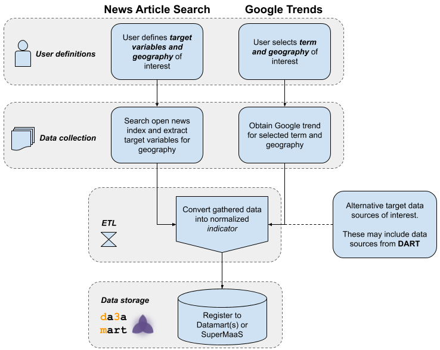

# Open Indicators
The goal of this project is to generate well-structured time series indicators from open data for World Modeling. 

This repository contains resources that provide an end-to-end capability to:

  - Gather open-source data
  - Transform the raw data into a normalized, well [documented schema](https://docs.google.com/spreadsheets/d/1BI0hsomtAyuzDTwc-7EgDxx8y1uTpsmeGWaEEPUGCXc/edit#gid=0)
  - Verify schema-compliance, and 
  - Register the dataset to a Datamart or SuperMaaS 

## Contents
1. [Current Models](#current-models)
2. [Quick Start](#quick-start)

## Current Models:

Open data has been demonstrated to be a useful input to modeling. For example, researchers at University of Oulu, University of Melbourne, and Harokopio University of Athens demonstrated the viability of using Google Trends for modeling refugee movement in their paper [Correlating Refugee Border Crossings with Internet Search Data](http://jultika.oulu.fi/files/nbnfi-fe201901222715.pdf).

There are two models in this repository for gathering open-source data: Google Trends and News Article Search. Google Trends searches for keywords and returns trend data for a specific location and News Article Search provides an interface to develop and run news queries for concepts and keywords of interest for user-defined geographical areas.  For more information click: [Google Trends](https://github.com/jataware/open_-indicators/tree/master/google-trends) or [News Article Search](https://github.com/jataware/open-indicators/tree/master/news-article-search).

## Quick Start:

#### This section highlights the general procedures for deployment. 

> For detailed instructions on how to run each program, reference the README for the program of choice.

#### General Start:

1. Clone the [open-indicators](https://github.com/jataware/open-indicators) repository to `your/local/folder`.
2. run `cd your/local/folder/open-indicators/news-article-search && pip install -r requirements.txt`
3. Clone the [Datamart-Integration](https://github.com/WorldModelers/Datamart-Integration) repository to `your/local/folder`.
4. run `cd your/local/folder/Datamart-Integration/verify_and_register && pip install -r requirements.txt`

#### Google Trends:

1. run `cd open-indicators/google-trends/`
2. run `python trends.py --term=teff --geo=ET-AA --output=teff.csv`

#### News Article Search:

1. run `cd your/local/folder/open-indicators/news-article-search/`
2. Create user-defined .yaml with webapp and move downloaded file to: `cd your/local/folder/open-indicators/news-article-search/`
3. Update the `config.ini` file.
4. Update your geo-polical .csv.
5. Run News Article Search. While it depends on your search parameters and size of your geo-political .csv, expect this to run for ~24 hours. You'll need to keep your computer on or run it on a remote server and detach the run from your local machine (such as with screenrc).

 `python3 src/main.py -r=results/results.json -geo=geo/geo.csv -defs=user_search.yaml`

#### Curate News Results:
To register the News Article Search results, the `results.json` file needs to be transformed to a schema-compliant .csv:

1. run `cd your/local/folder/open-indicators/news-schema/`
2. Copy your `user_search.yaml` (from the webapp UI) to `your/local/folder/open-indicators/news-schema/news/`
3. Copy your `results.json` (from the News Article Search) to `your/local/folder/open-indicators/news-schema/news/`
4. You must add metadata to the yaml file.  Cut and paste the snippet below into your yaml file, update the values, and save.

        admin:
          adminX: <ENTER THE LOWER ADMIN LEVEL>
          adminY: <ENTER THE HIGHER ADMIN LEVEL>
          country: <ENTER THE COUNTRY>

    Example:
    
        admin:
          adminX: admin_1
          adminY: admin_3
          country: United States

5. run `python3 news-csv.py --news=news/results.json --yaml=news/user_search.yaml --output=news/results.csv --type=False`
6. Your file for registration will be in the ../news folder. 
#### Verify and Register the dataset:

This program will verify the schema from the step above and allow you to register the dataset with a Datamart.

Below,`results.csv` is the either the News Article or Google Trends output file.
1. run `cd your/local/folder/Datamart-Integration/verify_and_register/`.
2. Run the script:
  
    To run the registration locally: Build the docker containers and

   run `python3 dataset.py results.csv local`

   To run remotely: you do not need the docker containers, but you will be registering data to a live Datamart.

   run `python3 dataset.py results.csv remote`

3. Verify dataset registration with a `curl` or searching the UI for your dataset.

