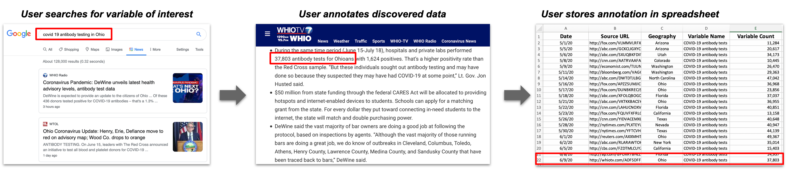

# Open Indicators

The goal of this project is to generate well-structured time series indicators from open data for modeling.

## Contents
1. [Motivation](#motivation)
2. [Overview](#overview)
3. [Modules](#modules)
4. [Quick Start](#quick-start)


## Motivation
The motivation behind this project was our experience working with COVID-19 modelers gathering data on non-pharmaceutical interventions (NPIs) such as mandatory business/school closures, mask requirements, and social distancing requiremments. Modelers needed a way to identify where and when NPIs had been implemented at the city, county, state and country level. These modelers work with analysts who rely on search engines to find information of interest, manually annotate results, and manually store those results into spreadsheets for use in modeling workflows. 



## Overview
Our goal is to automate as much of this as possible. This repository contains resources that provide an end-to-end capability to:

  - Gather open-source data
  - Transform the raw data into a normalized, well [documented schema](https://docs.google.com/spreadsheets/d/1BI0hsomtAyuzDTwc-7EgDxx8y1uTpsmeGWaEEPUGCXc/edit#gid=0)
  - Verify schema-compliance, and 
  - Register the dataset to a Datamart or SuperMaaS 


## Modules:

Open data has been demonstrated to be a useful input to modeling. For example, researchers at University of Oulu, University of Melbourne, and Harokopio University of Athens demonstrated the viability of using Google Trends for modeling refugee movement in their paper [Correlating Refugee Border Crossings with Internet Search Data](http://jultika.oulu.fi/files/nbnfi-fe201901222715.pdf).

There are two modules in this repository for gathering open-source data: Google Trends and News Article Search. Google Trends searches for keywords and returns trend data for a specific location and News Article Search provides an interface to develop and run news queries for concepts and keywords of interest for user-defined geographical areas. For more detailed information on each module see: [Google Trends](https://github.com/jataware/open_-indicators/tree/master/google-trends) or [News Article Search](https://github.com/jataware/open-indicators/tree/master/news-article-search).


## Quick Start:

> This section highlights the general procedures for deployment. For more detailed instructions on how to run each module, reference the README for the module of your choice.

### General Start:

1. Clone the [open-indicators](https://github.com/jataware/open-indicators) repository to `your/local/folder`.
2. run `cd open-indicators/news-article-search && pip install -r requirements.txt`
3. Clone the [Datamart-Integration](https://github.com/WorldModelers/Datamart-Integration) repository to `your/local/folder`.
4. run `cd Datamart-Integration/verify_and_register && pip install -r requirements.txt`

### Google Trends:

1. run `cd open-indicators/google-trends/`
2. run `python trends.py --term=teff --geo=ET-AA --output=teff.csv`

### News Article Search:

1. run `cd open-indicators/news-article-search/`
2. Create user-defined .yaml with webapp and move downloaded file to: `cd open-indicators/news-article-search/`
3. Update the `config.ini` file.
4. Update your geolocation `.csv` file.
5. Run News Article Search with  `python3 src/main.py -r=results/results.json -geo=geo/geo.csv -defs=user_search.yaml`

> Runtime depends on your search parameters and the number of geolocations of interest in your geolocation `.csv`. Potential runtimes may exceed ~24 hours. You'll need to keep your computer on or run it on a remote server and detach the run from your local machine (such as with screenrc).

### Curate News Results:
To register the News Article Search results to a Datamart, the `results.json` file needs to be transformed to a schema-compliant `.csv`:

1. run `cd open-indicators/news-schema/`
2. Copy your `user_search.yaml` (from the webapp UI) to `open-indicators/news-schema/news/`
3. Copy your `results.json` (from the News Article Search) to `open-indicators/news-schema/news/`
4. You must add metadata to the yaml file.  Cut and paste the snippet below into your yaml file, update the values, and save.

```
        admin:
          adminX: <ENTER THE LOWER ADMIN LEVEL>
          adminY: <ENTER THE HIGHER ADMIN LEVEL>
          country: <ENTER THE COUNTRY>
```

Example:

```    
        admin:
          adminX: admin_1
          adminY: admin_3
          country: United States
```

5. run `python3 news-csv.py --news=news/results.json --yaml=news/user_search.yaml --output=news/results.csv --type=False`
6. Your file for registration will be in the `../news` folder. 

### Verify and Register the dataset:

This program will verify the schema from the step above and allow you to register the dataset with a Datamart.

Below,`results.csv` is the either the News Article or Google Trends output file.

1. run `cd Datamart-Integration/verify_and_register/`.
2. Run the registration script: `python3 dataset.py results.csv remote`
3. Verify dataset registration with a `curl` or searching the UI for your dataset.

> **Note**: this registers your dataset to the live Datamarts. To register it to a local Datamart (for testing purposes) run `python3 dataset.py results.csv local`. This assumes you have the two Datamarts running locally (in Docker).